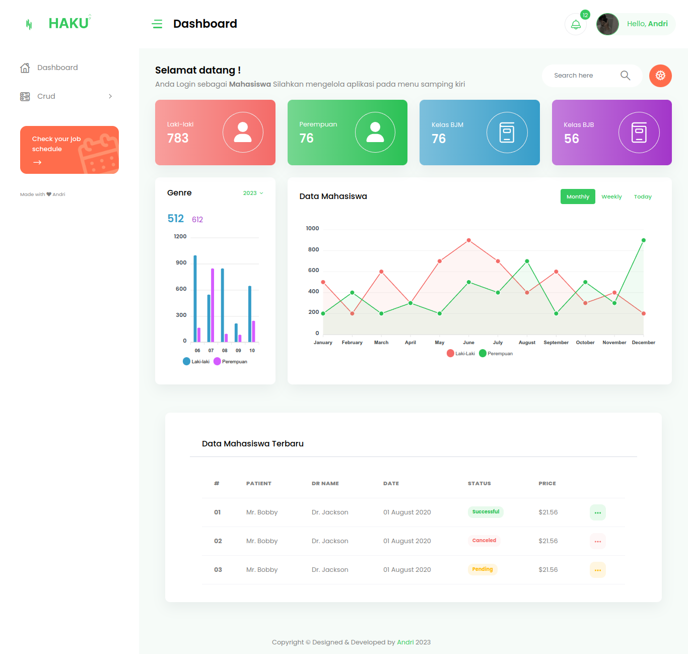
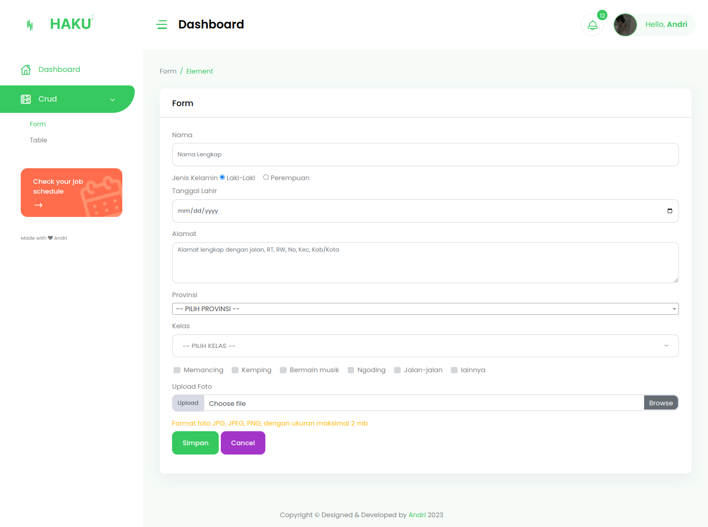
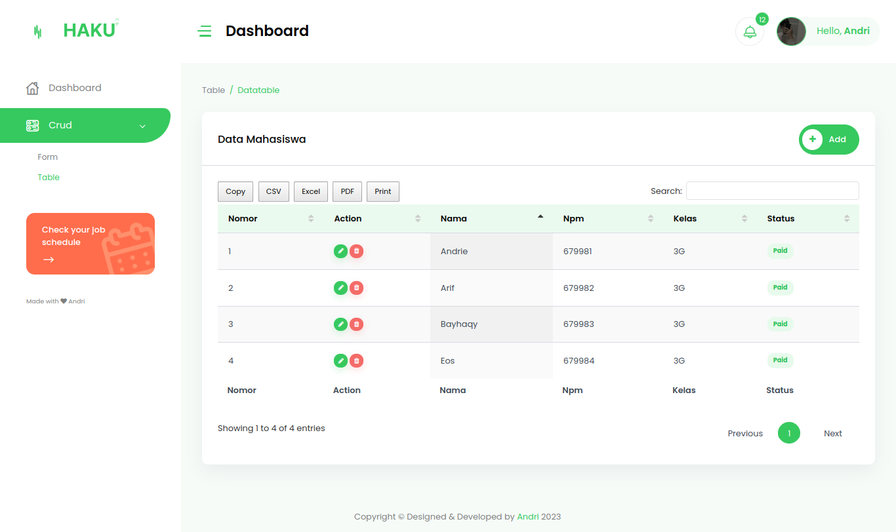

 
<h1>Sistem informasi data mahasiswa </h1>

<h2 style="color: #44AEFB" align="center" >Languages and Tools</h2> 

 
  
    

  
  
   <a href="https://www.linux.org/" target="_blank" rel="noreferrer">   

 

# <h3>1. Page Login</h3>
   

# <h3>2. Dashboard </h3>
    

# <h3>3. Form</h3>
    

# <h3>4. Tabel</h3>
 

Create by andri❤️ 
